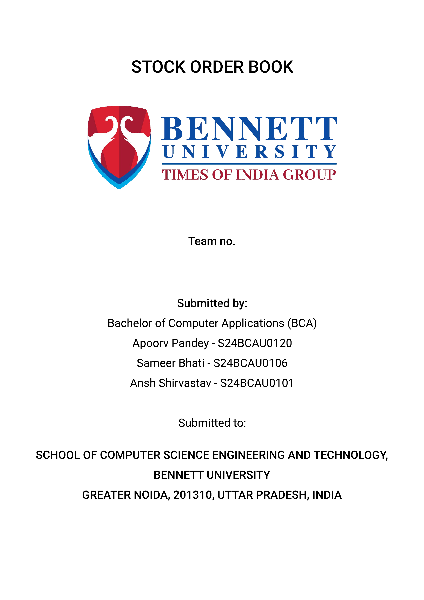

<div style="text-align:center; page-break-after: always;">
  
</div>

# DECLARATION

I/We hereby declare that the work presented in this report entitled **"Stock Order Book with Real-Time Matching Engine"** is an authentic record of our own work carried out at School of Computer Science Engineering and Technology, Bennett University, Greater Noida.

The matter and results presented in this report have not been submitted by us for the award of any other degree or diploma elsewhere.

**Apoorva Pandey**  
(**S24BCAU0120**)

**Ansh Shirvastav**  
(**S24BCAU0102**)

**Sameer Bhati**  
(**S24BCAU0106**)

<div class="page-break"></div>

# ACKNOWLEDGEMENT

We would like to express our sincere thanks to our mentor, faculty members, and the School of Computer Science Engineering and Technology for giving us the guidance and support needed during this project. So, this project took many rounds of designing, coding, debugging, changing things again, and then testing one more time, and the help from teachers and teammates really mattered in that whole process.

Also, we are thankful to our friends and classmates who gave feedback on the system and helped in checking the usability of the order book screens. And, finally, we thank our team members because this project had both frontend work and backend system logic, so it was not possible without proper division of work.

**Signature of Candidate(s)**

**Apoorva Pandey**  
(**S24BCAU0120**)

**Ansh Shirvastav**  
(**S24BCAU0102**)

**Sameer Bhati**  
(**S24BCAU0106**)

<div class="page-break"></div>

# TABLE OF CONTENTS

- [LIST OF TABLES](#list-of-tables)
- [LIST OF FIGURES](#list-of-figures)
- [LIST OF ABBREVIATIONS](#list-of-abbreviations)
- [ABSTRACT](#abstract)
- [1. INTRODUCTION](#1-introduction)
  - [1.1 Problem Statement](#11-problem-statement)
- [2. BACKGROUND RESEARCH](#2-background-research)
  - [2.1 Proposed System](#21-proposed-system)
  - [2.2 Goals and Objectives](#22-goals-and-objectives)
- [3. PROJECT PLANNING](#3-project-planning)
  - [3.1 Project Lifecycle](#31-project-lifecycle)
  - [3.2 Project Setup](#32-project-setup)
  - [3.3 Stakeholders](#33-stakeholders)
  - [3.4 Project Resources](#34-project-resources)
  - [3.5 Assumptions](#35-assumptions)
- [4. PROJECT TRACKING](#4-project-tracking)
  - [4.1 Tracking](#41-tracking)
  - [4.2 Communication Plan](#42-communication-plan)
  - [4.3 Deliverables](#43-deliverables)
- [5. SYSTEM ANALYSIS AND DESIGN](#5-system-analysis-and-design)
  - [5.1 Overall Description](#51-overall-description)
  - [5.2 Users and Roles](#52-users-and-roles)
  - [5.3 Design Diagrams / UML / Flow / E-R](#53-design-diagrams--uml--flow--e-r)
    - [5.3.1 Product Backlog Items](#531-product-backlog-items)
    - [5.3.2 Architecture Diagram](#532-architecture-diagram)
    - [5.3.3 Use Case Diagram](#533-use-case-diagram)
    - [5.3.4 Class Diagram](#534-class-diagram)
    - [5.3.5 Activity Diagram](#535-activity-diagram)
    - [5.3.6 Sequence Diagram](#536-sequence-diagram)
    - [5.3.7 Data Architecture / ER Diagram](#537-data-architecture--er-diagram)
- [6. USER INTERFACE](#6-user-interface)
  - [6.1 UI Description](#61-ui-description)
  - [6.2 UI Mockup](#62-ui-mockup)
- [7. ALGORITHMS / PSEUDO CODE](#7-algorithms--pseudo-code)
- [8. PROJECT CLOSURE](#8-project-closure)
  - [8.1 Goals / Vision](#81-goals--vision)
  - [8.2 Delivered Solution](#82-delivered-solution)
  - [8.3 Remaining Work](#83-remaining-work)
- [REFERENCES](#references)

<div class="page-break"></div>

# LIST OF TABLES

1. Table 1: Goals and Objectives
2. Table 2: Project Setup Decisions
3. Table 3: Stakeholders
4. Table 4: Project Resources
5. Table 5: Assumptions
6. Table 6: Tracking Information
7. Table 7: Regularly Scheduled Meetings
8. Table 8: Information To Be Shared Within Our Group
9. Table 9: Information To Be Provided To Other Groups
10. Table 10: Information Needed From Other Groups
11. Table 11: Deliverables
12. Table 12: Users and Roles

<div class="page-break"></div>

# LIST OF FIGURES

1. Figure 1: Architecture Diagram
2. Figure 2: Use Case Diagram
3. Figure 3: Class Diagram
4. Figure 4: Activity Diagram
5. Figure 5: Sequence Diagram
6. Figure 6: ER Diagram
7. Figure 7: UI Mockup

<div class="page-break"></div>

# LIST OF ABBREVIATIONS

| Abbreviation | Meaning                           |
| ------------ | --------------------------------- |
| API          | Application Programming Interface |
| ER           | Entity Relationship               |
| FIFO         | First In First Out                |
| JSON         | JavaScript Object Notation        |
| SRP          | Single Responsibility Principle   |
| tRPC         | Type-safe Remote Procedure Call   |
| UI           | User Interface                    |
| WS           | WebSocket                         |

<div class="page-break"></div>

# ABSTRACT

Our project presents you with a real-time stock order book system that simulates a real-alike trading platform where users can place buy and sell orders and receive live updates in the interface. We created this project as a monorepo project with a React, Node.js, and GO matching ending all in a single repository. We designed the backend logic with absolute separation where the order book stores market state, the matching engine handles business rules, while the portfolio manager manages the money balance.

Our main idea was to implement a price time priority matching system that was fast enough for repeated read and writes. With earlier implementations using a simple array sorting method, which was very inefficient but helped us to get the basic matching book understanding. Then we moved to a HashMap method which was faster for lookups but still had inefficiency in order removals.
For the final version, we used a linked queue for each price level that solved the order removal complexity. In the same time, we also created a GO rewrite of the matching engine, while following the same final version's data structure and integrated it as a separate service that the Node.js server could call without changing any major backend logic.

There was also full focus on providing a secure platform Firebase authentication. We also made sure that system used fast broadcasting services like Socket.io to make sure updates are instant while being efficient. The final result was not just a simple UI demo, rather it showcased a well designed system, along with algorithm choice, service creation.

<div class="page-break"></div>

# 1. INTRODUCTION

We created this project named "Stock Order Book" for simulating buy and sell orders like a real trading platform. This will sound simple, but once we start to get into the data structure part of the matching engine, things take a U turn. And it also grows in complexity once we start to add performance constrains. For this project, we used a pretty modular tech stack, also a very popular one too. This includes React and Node.js, for frontend and backend respectively. And for the matching engine, we created a GO service for fast order matching. And this fast matching is shown to the frontend with Socket.io to broadcast the order book changes in real time.
Security is handled with firebase.

## 1.1 Problem Statement

There are existing solutions like Paathshaala and Moneybhai that does exactly or even better than our solution. But they are mainly built as a trade learning platform that do not expose the technical workings of matching engine. Our project is focused more towards the technical side of system, for students in technical degrees, like BTECH, BCA and MBA students who want to understand the algorithmic side of trading.

Hence, we built this. A open-source, educational, easy to run that explains the how of trading.

---

# 2. BACKGROUND RESEARCH

Our project is a very well researched problem in computer science and finance engineering. It is very popular for the order book optimization problem because of different choices in algorithm design along with their tradeoffs. While most platforms use price-time priority matching, the way they implement it varies widely based on their specific needs.

As discussed earlier. Platforms like Paathshaala and Moneybhai are more focused on the financial education side, and they do not show the technical workings of the matching engine. They are a good fit for people, who want to learn how to trade, but not for people who want to learn how trading works behind the curtains. This behind the curtains part include things like, how orders are stored, how they are matched, how the updates are carried out, and how the performance can be improved by changing data structures.

This is especially common for students in computer science programs like BCA, BTech, or hybrid technical MBA/finance programs because those students work with data structures, algorithms, not just financial strategies.
For example, trading performance can change drastically when changing from a sorted array approach to a HashMap-based approach. We implemented many version of this matching algorithm with different data structures and measured their performance with benchmarking scripts.

For this exact algorithm design part. We researched how production matching engines are designed. This was usually done through a combination of academic papers [ reference them ], and open source projects [ reference them ]. We found, that the price time priority matching is the most common approach, but the data structure choice varies with every platform. Some use sorted arrays, others HashMaps, and some use more complex structures like linked queues per price level for maximum performance.

## 2.1 Proposed System

What we propose is a full-stack stock order book simulator built truly from the group up. This includes, a from scratch implementation of the matching engine. We have target users of student type in technical programs who like to understand not just how to trade but how the matching engine processes orders.

The system is mainly designed for desktop use. One can easily spin up a local instance by cloning the repository and then running the npm run dev command. There are market maker scripts for automated live order flow. A cli order book preview. And a fully built frontend UI that can be accessed through a web browser. Is it to note that there are no real stock exchange connection.

Project is designed to be open source with MIT license. Light enough to run in most regular hardware but complex enough to show real workings of trading system.

## 2.2 Goals and Objectives

| #   | Goal or Objective                                                |
| --- | ---------------------------------------------------------------- |
| 1   | Build a real-time order book simulation for buy and sell orders. |
| 2   | Maintain price-time priority during order execution.             |
| 3   | Provide fast best bid and best ask for the UI updates.           |
| 4   | Prevent invalid trades using portfolio checks.                   |
| 5   | Improve matching performance by integrating a Go-based engine.   |
| 9   | Keep the system modular so components can be replaced later.     |

**Table 1: Goals and Objectives**

Project sole object was not to just create a feature based order book. But also to craft a well designed system with properly designed modules, clear separation and clean code. The later part was a big plus for us students as a learning experience on how to actually write and maintain real codebase.

---

# 3. PROJECT PLANNING

## 3.1 Project Lifecycle

We followed the Agile model. It wasn't the full enterprise like, but a simplified one. We sticked to it because that was what taught in previous courses as a good development approach.

A quick info of the project lifecycle as:

1. Repo was setup
2. Then the typescript interfaces and matching logic was developed
3. There was performance backlogs, hence we improved the data structures
4. A Go service was developed for lower and faster matching

## 3.2 Project Setup

| #   | Decision Description |
| --- | -------------------- |

1 It was initially planned to separate repos for frontend and backend, but we switched to a monorepo because separate repos were making coordination too complicated
2 We used pnpm instead of npm for reduced install times.
4 It was decided to use React + Vite for client, Node.js + tRPC for server for fast development and type safety.
5 Socket.io was used for live order book broadcasting
6 For authentication we used Firebase because building a custom auth system from scratch was too much effort and also out of scope of this project.
8 Go match system service was also created for the final version for performance and latency.

## 3.3 Stakeholders

**Table 2: Project Setup Decisions**

| Stakeholder            | Role                                   |
| ---------------------- | -------------------------------------- |
| Project Team           | Design, coding, testing, documentation |
| Faculty Mentor         | Guidance, review, technical feedback   |
| End Users / Demo Users | Use the system and give feedback       |
| Future Developers      | Can extend matching logic or UI later  |

**Table 3: Stakeholders**

## 3.4 Project Resources

| Resource            | Resource Description                              | Quantity |
| ------------------- | ------------------------------------------------- | -------- |
| Team Members        | Students working on frontend, backend, and report | 3-4      |
| Developer Machines  | Laptops/desktops used for coding and testing      | 3-4      |
| Node.js Environment | Used for backend APIs and integration             | 1        |
| React Development   | Used for UI build and testing                     | 1        |
| Go Runtime          | Used for the Go matching engine                   | 1        |
| Firebase            | Used for authentication support                   | 1        |
| GitHub Repository   | Used for source code tracking                     | 1        |

**Table 4: Project Resources**

## 3.5 Assumptions

| #   | Assumption |
| --- | ---------- |

A1 Team members would be able to meet and coordinate work regularly
A2 Local development environments for Node.js, React, and Go would be available
A3 Firebase authentication would be used for simplicity
A4 Order book design will be in-memory, hence, no database required
A5 There will be performance comparison between TypeScript and Go versions of the matching engine
A6 The project is desktop only; no mobile specific UI is required
A7 Market marker script would be used to generate live order flow for testing

**Table 5: Assumptions**

---

# 4. PROJECT TRACKING

## 4.1 Tracking

| Information           | Description                                                                  | Link                         |
| --------------------- | ---------------------------------------------------------------------------- | ---------------------------- |
| Code Storage          | Source code is stored in GitHub repository                                   | github.com/REDACTED/REDACTED |
| Branch-Based Progress | master branch for stable work, feature/go-matching-engine for Go integration | Repository branches          |
| Documentation         | Architecture, UML diagrams, order matching system docs in docs/              | docs/ directory              |
| Benchmarks            | Benchmark and timing scripts for TypeScript and Go comparison                | Server / Go packages         |
| Bug Tracking          | Tracked through Git commits and direct team communication                    | Commit history               |

**Table 6: Tracking Information**

## 4.2 Communication Plan

### Regularly Scheduled Meetings

| Meeting Type                  | Frequency / Schedule               | Who Attends             |
| ----------------------------- | ---------------------------------- | ----------------------- |
| Team Discussion               | Weekly                             | Project team            |
| Weekly in lab Progress Review | Weekly                             | Project team and mentor |
| Internal Debug Session        | As needed                          | Relevant team members   |
| Final Review Prep             | Before submission and presentation | Full team and mentor    |

**Table 7: Regularly Scheduled Meetings**

### Information To Be Shared Within Our Group

| Who?         | What Information?                 | When?                 | How?         |
| ------------ | --------------------------------- | --------------------- | ------------ |
| Project Team | Task allocation                   | Weekly                | Group chat   |
| Project Team | Code changes and bug fixes        | As needed             | Git commits  |
| Project Team | Design changes in matching engine | During implementation | Shared notes |

**Table 8: Information To Be Shared Within Our Group**

### Information To Be Provided To Other Groups

| Who?                | What Information?  | When?                 | How?                         |
| ------------------- | ------------------ | --------------------- | ---------------------------- |
| Mentor / Instructor | Milestone progress | At reviews            | Demo / report / presentation |
| Mentor / Instructor | Final deliverables | At project completion | Report, PPT, source code     |

**Table 9: Information To Be Provided To Other Groups**

### Information Needed From Other Groups

| Who?                | What Information?                      | When?                   | How?                  |
| ------------------- | -------------------------------------- | ----------------------- | --------------------- |
| Mentor / Instructor | Technical suggestions                  | Throughout project      | Weekly lab discussion |
| Faculty             | Formatting and submission requirements | Before final submission | Course instructions   |

**Table 10: Information Needed From Other Groups**

## 4.3 Deliverables

| #   | Deliverable                                         |
| --- | --------------------------------------------------- |
| 1   | Fully working frontend for viewing order book       |
| 2   | Matching logic                                      |
| 3   | Real time update support with the help of Socket.io |
| 5   | Go-based matching engine integration                |
| 6   | Documentation in repository                         |
| 7   | Presentation slides                                 |
| 8   | Final project report, 5 minute video demo           |

**Table 11: Deliverables**

---

# 5. SYSTEM ANALYSIS AND DESIGN

## 5.1 Overall Description

This repository is a collection of three repos. Hence, we call it a monorepo. This contains, client, and server code, along with the shared type interfaces. This helped us in maintaining a better management. For frontend, we used React to quickly get responsive UI. With tailwind kicking in for the absolute speed. Then, for updates, Socker.Io is used with firebase for secure authentication. Communication between frontend and backend is done with TRPC for better performance than HTTP.

## 5.2 Users and Roles

| User | Description |
| ---- | ----------- |

User Description
Trader / End User Allows users to log in, place buy or sell orders, view the order book, and track their portfolio.
System Backend Handles validation, balance checks, order matching, and update notifications
Matching Engine Uses price-time priority to match orders and shows executed trades along with pending ones.
Developer Handles the user interface, server-side operations, and data structure management
Mentor / Evaluator Evaluates design, verifies output, and checks documentation quality.

**Table 12: Users and Roles**

## 5.3 Design Diagrams / UML / Flow / E-R

### 5.3.1 Product Backlog Items

Major backlog items:

- As a user, I want to sign in securely so that I can access my trading account.
- As a user, I want to place buy orders easily so that I can purchase stock from the market.
- As a user, I want to place sell orders easily so that I can liquidate stock to others.
- As a user, I want to see best bid and best ask live so that I can understand live market conditions.
- As a user, I want my portfolio automatically updated after a trade so that I know my remaining balance and holdings.
- As a developer, I want shared types between frontend and backend so that models are consistent and easy to debug.
- As a developer, I want to replace the matching engine without changing the frontend so performance changes are easier to test.

### 5.3.2 Architecture Diagram

<div class="figure-block uml-figure">

**Figure 1: Architecture Diagram**


</div>

### 5.3.3 Use Case Diagram

<div class="figure-block uml-figure">

**Figure 2: Use Case Diagram**


</div>

### 5.3.4 Class Diagram

<div class="figure-block uml-figure">

**Figure 3: Class Diagram**


</div>

This class level view shows the order book handling storage, matching engine logic, portfolio manager tracking.

### 5.3.5 Activity Diagram

<div class="figure-block uml-figure uml-large">

**Figure 4: Activity Diagram**


</div>

### 5.3.6 Sequence Diagram

<div class="figure-block uml-figure">

**Figure 5: Sequence Diagram**


</div>

### 5.3.7 Data Architecture / ER Diagram

<div class="figure-block uml-figure">

**Figure 6: ER Diagram**


</div>

To note. Current system operates in in-memory. So there are no actual database tables. This ER diagram is placed for a future release where persistent storage will be added.

---

# 6. USER INTERFACE

## 6.1 UI Description

As discussed earlier. We used React.js for the quick development of UI. This mainly handles the User form interaction like bids, asks orders and showing the portfolio information. This is then integrated with socket.io to receive updates from order book. The main components of UI include the order book, trade form and the portfolio section. UI was designed to be simple, because the main focus was on the backend logic and the matching engine.

## 6.2 UI Mockup

**Figure 7: UI Mockup**

```text
attach the react UI screenshot
```

---

# 7. ALGORITHMS / PSEUDO CODE

## Core Matching Algorithm

System follows price time priority. Better price goes first, and if price is the same then earlier timestamp gets the priority.
Below is the pseudo code for the matching algorithm.

```text
Algorithm PlaceOrder(order):
    validate order price > 0
    validate order quantity > 0
    validate user can afford order

    if order.side == "buy":
        while order.quantity > 0 and bestAsk exists and order.price >= bestAsk.price:
            maker = bestAsk
            tradeQty = min(order.quantity, maker.quantity)
            create trade at maker.price
            reduce maker.quantity by tradeQty
            reduce order.quantity by tradeQty
            if maker.quantity == 0:
                remove maker from order book

    else if order.side == "sell":
        while order.quantity > 0 and bestBid exists and order.price <= bestBid.price:
            maker = bestBid
            tradeQty = min(order.quantity, maker.quantity)
            create trade at maker.price
            reduce maker.quantity by tradeQty
            reduce order.quantity by tradeQty
            if maker.quantity == 0:
                remove maker from order book

    if order.quantity > 0:
        add remaining order to order book

    return trades and remaining order
```

## Data Structure Evolution

```text
Naive Version:
    addOrder -> push + full sort
    removeOrder -> linear scan + splice

Hybrid Version:
    addOrder -> hash maps + sorted price arrays
    removeOrder -> O(1) map lookup + array splice

Optimized Version:
    addOrder -> sorted price levels + linked queue append
    removeOrder -> direct node unlink in O(1)
```

The naive version uses full sorted arrays and re-sorts on insertion, the hybrid version uses HashMaps and sorted arrays, and the optimized version uses linked queues per price level for better removal performance.

---

# 8. PROJECT CLOSURE

## 8.1 Goals / Vision

Our original goal was to build a relatively simple order book matching logic, with simple buy and sell orders. But as we progressed through. We started exploring more into the performance side of matching engine. Hence, we found the GO lang to integrate the engine with. This was a major shift in project complexity. But the original behavior remained original with massive performance boosts.

## 8.2 Delivered Solution

In the end, we created a project that bundles together a react frontend with a node.js backend. That uses modern features like socket.io for broadcasting and a well documented codebase with documentation, diagrams and good amount of comments. While the go languagej communication is done with a simple HTTP/JSON feature. We originally planned to use gRPC but due to time constrains. We used the HTTP path instead. There were also performance improvements in the data structure design of matching engine with 3 level optimizations.

## 8.3 Remaining Work

Based on the planned weeks 9-12 and known outstanding items:

- It is planned to add tooltip labels for bid and ask panels, because multiple testers got confused without them.

- To deploy a live persistent demo URL so it can be accessed without local setup.

- Because a demo URL is setup is also planned. There needs to be CI/CD with GitHub Actions to automatically deploy on code changes.

- There will also be a Docker compose file for portable deployment

- One more important feature is to add session persistence so trade history survives when server is restarted.

- Possibly support for smaller screens even if full responsive design is not in plan.

---

# REFERENCES

1. R. Cont and A. de Larrard, “Price dynamics in a Markovian limit order market,” _SIAM Journal on Financial Mathematics_, vol. 4, no. 1, pp. 1–25, 2013, doi: 10.1137/110856605.
2. R. Cont, A. Kukanov, and S. Stoikov, “The price impact of order book events,” _Journal of Financial Econometrics_, vol. 12, no. 1, pp. 47–88, Winter 2014, doi: 10.1093/jjfinec/nbt003.
3. M. D. Gould, M. A. Porter, S. Williams, M. McDonald, D. J. Fenn, and S. D. Howison, “Limit order books,” arXiv:1012.0349, 2013, doi: 10.48550/arXiv.1012.0349.
4. W. Huang, C.-A. Lehalle, and M. Rosenbaum, “Simulating and analyzing order book data: The queue-reactive model,” arXiv:1312.0563, 2014, doi: 10.48550/arXiv.1312.0563.
5. Socket.IO, “Socket.IO Documentation (v4): Introduction,” 2026. [Online]. Available: https://socket.io/docs/v4/. [Accessed: May 4, 2026].
6. Google, “Firebase Authentication,” _Firebase Documentation_, 2026. [Online]. Available: https://firebase.google.com/docs/auth. [Accessed: May 4, 2026].
7. tRPC, “tRPC Documentation (v11.x),” 2026. [Online]. Available: https://trpc.io/docs. [Accessed: May 4, 2026].
8. Meta, “React Documentation,” 2026. [Online]. Available: https://react.dev/. [Accessed: May 4, 2026].
9. OpenJS Foundation, “Node.js v25.9.0 Documentation,” 2026. [Online]. Available: https://nodejs.org/docs/latest/api/. [Accessed: May 4, 2026].
10. The Go Authors, “Go Documentation,” 2026. [Online]. Available: https://go.dev/doc/. [Accessed: May 4, 2026].

---
